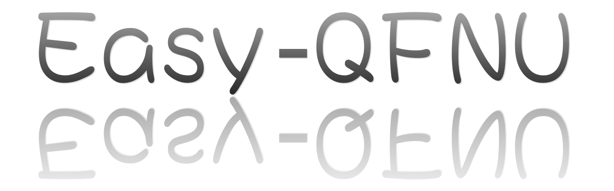

<!--  -->

<!-- 
<h1>Easy-QFNU 官方文档</h1>
 -->

<!-- 

    

 -->

能用自己所学的知识改变生活，就是成功。——Sunr1se 19保研成电天晴大哥

技术的最终归宿是服务和贡献社会。——Andy 曲师大研安工大哥

科技不再是高高在上，科技应该服务于每一个人。 —— 小米创始人雷军

[Easy-QFNU](https://Easy-QFNU.top/) 是由 [W1ndys](https://w1ndys.top/) 开发的一个免费、开源、共建、共享的文档式 Web 网站，[W1ndys](https://w1ndys.top/) 联合各学院数位同学共同编辑该站的内容，弥补你的信息差，帮助你更快地找到所需信息，致力于解决你在 QFNU 可能遇到的各种问题。

前身是 [曲师大选课指北](https://blog.w1ndys.top/posts/216d9006/) 和 [曲师大速通指南](https://blog.w1ndys.top/posts/8f8bbaa8/)

主站: [https://Easy-QFNU.top/](https://Easy-QFNU.top/)（全自动部署，数据最先更新）

备用站点:

| 站点       | 地址                      | 状态      |
| ---------- | ------------------------- | --------- |
| Vercel     | <https://v.Easy-QFNU.top> | ✅ 运行中 |
| Netlify    | <https://n.Easy-QFNU.top> | ✅ 运行中 |
| Zeabur     | <https://z.Easy-QFNU.top> | ✅ 运行中 |
| CloudFlare | <https://c.Easy-QFNU.top> | ❌ 停更   |
| Render     | <https://r.Easy-QFNU.top> | ❌ 停运   |

## Star History

# 致谢

## 感谢本项目的源代码贡献者

    

## 非源代码贡献者致谢

本项目框架的采用灵感来自于 [@ProbiusOfficial](https://github.com/ProbiusOfficial/) 的 [Hello-CTF](https://github.com/ProbiusOfficial/Hello-CTF/), 在一些细节上, 我借鉴了 Hello-CTF 的设计灵感/思路，以及仓库管理方案

本项目基于 Mkdocs-Material 项目开发，致谢 Mkdocs-Material 项目及其开发者们，Powered by mkdocs-material

致谢 [Mister-Hope](https://github.com/Mister-Hope) 在我开发和界面布局的指导建议。

