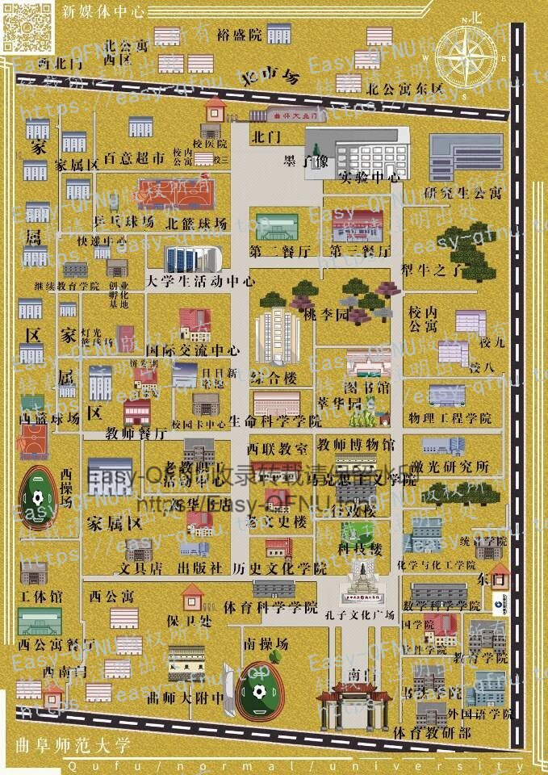
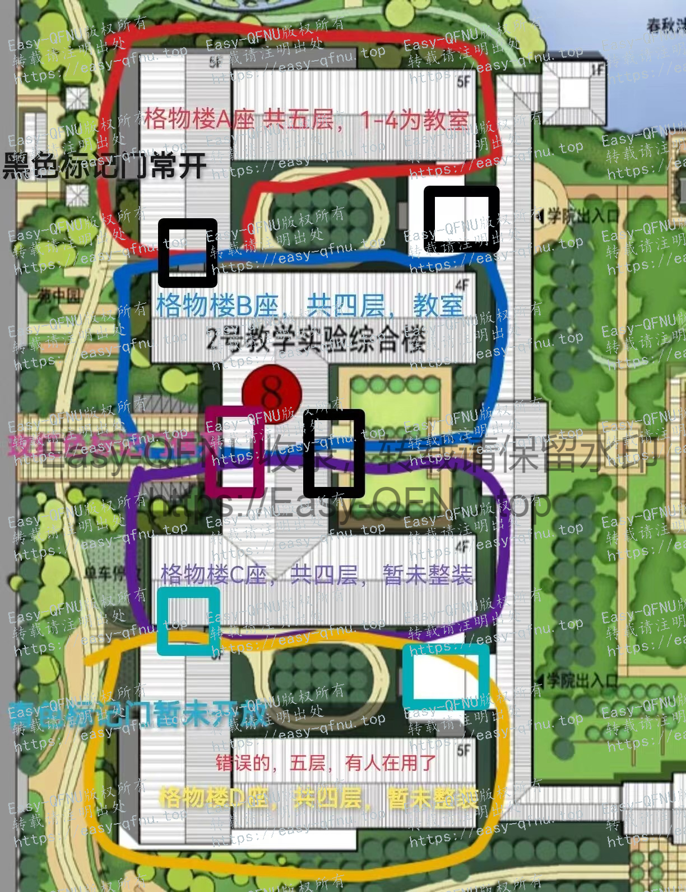
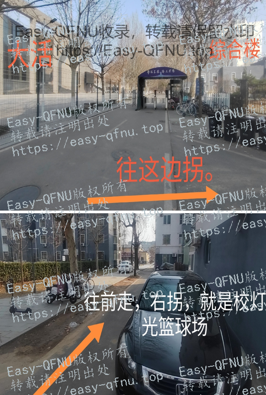
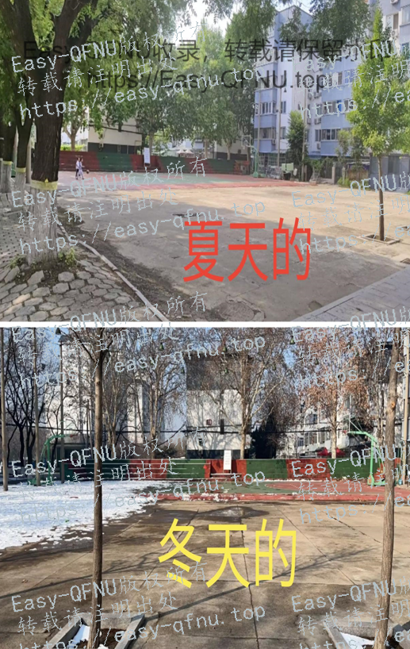
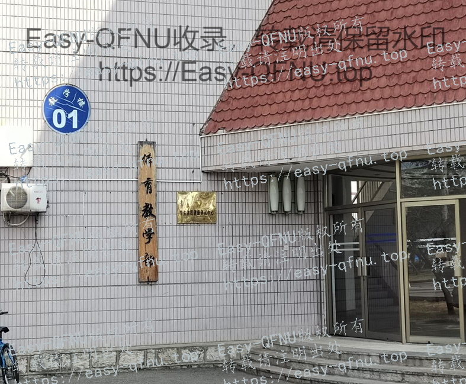
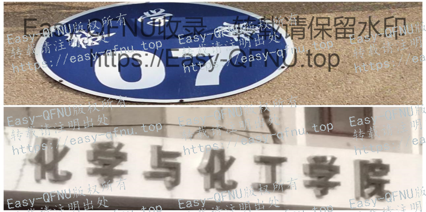
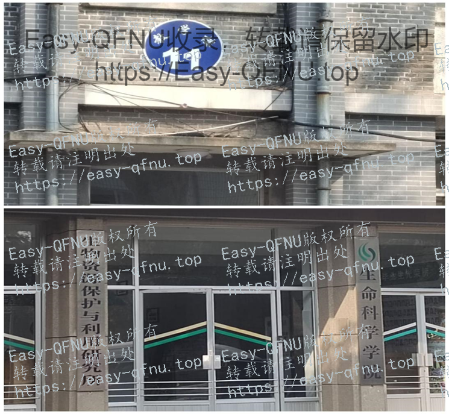
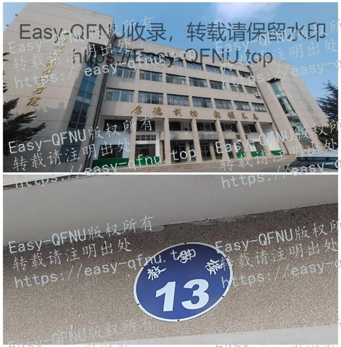
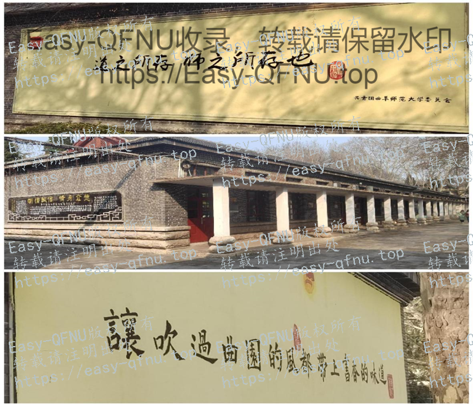
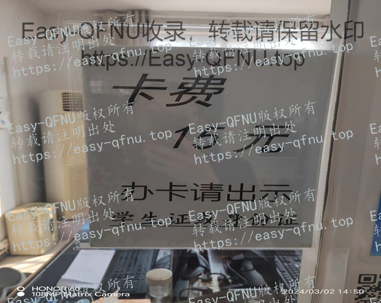

# 校区地图

仅迁移了数据，后续会进行页面排版优化。

> 曲阜校区飞天富贵鼠鼠, W1ndys, 希望数分别在折磨我了供图, 日照校区颜珞供图, 新校区图书馆地图晓镜供图, 格物楼地图带标记计算机爱好者协会供图

> 图片加载较慢, 若超过 10 秒未加载请刷新页面

## 曲阜校区地图

### 老校区地图

    
    

#### 综合楼卫生间地图

> 致谢：本图由 飞天富贵鼠鼠 提供

### 新校区地图

??? note "新校区地图超清"

    链接：[新校区地图超清——百度网盘](https://pan.baidu.com/s/1tn7qNd4PzjdZmqY6HpWdNw?pwd=1rz8)
    
    提取码：1rz8
    
    HASH 校验
    
    SHA256: **11f128423a5490ae1db3f501f186b320f7affec2d808bec8223526ff0b184440**
    
    MD5: **9aac1ce4978344497fa763d3d895069c**
    
    SHA1: **830146c6b32632cab9f5206755856f63700ae4ab**

    
    

#### 格物楼局部地图

> 致谢：本图由 计算机爱好者协会 提供

#### 文渊楼地图

> 致谢：本图由 晓镜 提供

    
    
    

### 综合地图

> 本图由 `希望数分别再折磨我了` 、`曲师大移动营业厅` 提供

    
    

## 日照校区地图

> 致谢：本图由 颜珞 提供

## 曲阜校区小众教室地点位置

> 特别致谢：本项数据由 飞天富贵鼠鼠 整理提供

针对找不到教室的同学, 特此整理（4 小时走遍老校区,2 小时整理）！注时间以后可能会变, 不保证以后依然有用（整理时间 2024.3.2）

### 总览

**运动场：**

排球场、网球场、校灯光篮球场、校北篮球场健美操教室

**教学楼**

1 号教学楼（体育教学部, 南操对面）

地理楼（心理学院,8 号教学楼）

文史楼（科技楼右边,5 层, 靠近联通营业厅）

老文史楼（2 层, 西联南边）

办公楼/行政楼

行政 1 号楼(科技楼正北方向)：保卫处/财务处/教务处/原马克思主义学院（现在的马克思主义学院已搬迁至致知楼一楼）

行政 2 号楼：原教博

**其他**

东门时间：7：00--20：00

移动营业厅：8：30--12：00,14：30--18：00

北门校医院营业时间：

8：30-17：30

14：00-17：30（冬春）14：30--18：00（夏秋）

新校区图书馆：7：30--22：00

### 运动场篇

#### 西操排球场（在西操篮球场旁边）

#### 网球场（在排球场旁边, 从排球场最里面的门进入）

#### 公体球类馆（西操的南边, 西公寓西边）

#### 校灯光篮球场

（靠近大活的家属区的门, 右拐往前走）

（教餐往北走, 看到曲园餐厅, 他就在曲园餐厅的西边）

照片

#### 校北篮球场健美教室

### 买书篇

#### 青青书屋【老板电话、微信号 13863734290】

南区 20 号, 靠近西公寓的第一栋楼。

有很多专业课、公选课课本, 小学到高中课本及参考资料, 课外书, 四六级题【也收一些旧纸板（买纸板先提前问问老板）】

#### 世达书店（老板电话、微信：13583725041）

——→ 教餐对面（早上 8 点～晚上 10 点）】

### 教学楼篇

教学楼 1 号（体育教学部）

教学楼 2 号 → 外语学院

教学楼 3 号 → 公共外语教学部

教学楼 4 号 → 国学院、网安学院

教学楼 5 号没找到, 可能是教育学院

教学楼 6 号 → 数科院

教学楼 7 号 → 化学院

地理楼——→ 现在分成了激光研究所和心理学院（教学 8 号楼）

教学楼 9 号

综合楼（教学楼 10 号）

生科院（教学楼 11）

老文史楼（教学楼 12）【西联南边】

——【老文史楼只有两层, 文史楼有 5 层】

文史楼（教学楼 13）【科技楼西边】

西联教室

实验中心

校友之家, 物理学院南边

### 办公楼

办公楼 01（西联教室东边）（人脸识别不了, 去保卫处找负责老师）

办公楼 02（原教博）

### 其他

东门: 早七到晚八

北门校医院工作时间

补办学生卡（教餐对面）

【移动厅也搬到了这里 8: 30-12: 00。14: 30-18: 00】

校区图书馆 7: 30--22：00
