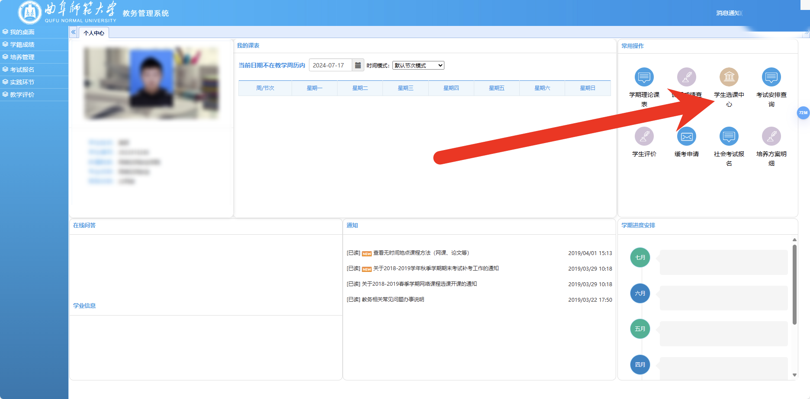

# 怎么选

!!! quote "作者声明"

    本页内容全部由 21 数学科学学院提供，由 Easy-QFNU 作者加以整理，Easy-QFNU 已得到原作者的授权

    本站内容仅供参考，不作为任何建议或意见，如有疑问请联系相关教务老师。

## 进教务系统

> 理论上来讲这三个网址最终指向的是同一个地址，只不过选课高峰期系统很卡，多一条选择的路而已

方法一：通过强智教务系统进入 [登录 (qfnu.edu.cn)](https://zhjw.qfnu.edu.cn/#/)

方法二：通过统一身份认证进入 [统一身份认证平台 (qfnu.edu.cn)](http://ids.qfnu.edu.cn/authserver/login?service=https%3A%2F%2Fzhjw.qfnu.edu.cn%2Fsso.jsp%23%2F#/)

方法三：通过服务大厅进入 [服务大厅 (qfnu.edu.cn)](http://ehall.qfnu.edu.cn/new/index.html)

## 登录选课

- 登录账号密码（账号密码和智慧曲园密码不一定完全一样，是由自己设置决定的）

- 进入界面，进入“学生选课中心”

- 选择标签，勾选选项，搜课程

  > 勾选选项：过滤冲突课程、过滤已满课程、过滤限选

- 搜课程：输入课程名称或课程编号，点击查询即可
- 其他选项：上课老师、上课校区、星期几、节次，都可以进行筛选，也可以不筛选
- 搜索界面会显示老师、地点时间、课余量
- 下方的课表可以退课

