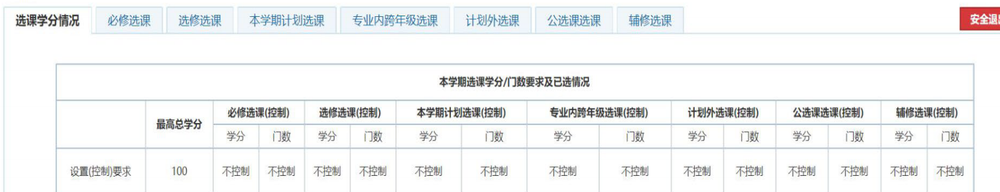

# 选课模块

!!! quote "作者声明"

    本页内容全部由 21 数学科学学院提供，由 Easy-QFNU 作者加以整理，Easy-QFNU 已得到原作者的授权
    
     本站内容仅供参考，不作为任何建议或意见，如有疑问请联系相关教务老师。

## 选课模块介绍

> 记住一句话：**搜不出课就取消勾选“过滤限制课程”，还不让选就换个模块搜出来**
>
> 记住这句话不用看下面也行

【本学期计划选课】包含课程设置总表中所有推荐学期为当前学期的课

【专业内跨年级选课】包含培养计划内所有课程

【计划外选课】本专业培养计划以外课程

【公选课选课】包含公共选修课（g 开头）和专题研讨课（yt 开头）

## 举个例子

### 【本学期计划选课】

《形势与政策专题四》《英语拓展课》《课程论文 1》《数学实验》的推荐学期都是 4，是当前学期（第 4 学期），可能在【本学期计划选课】。 【本学期计划选课】这个名字起的真是生动形象

### 【专业内跨年级选课】

《体育》《教师必修课程》《教师选修课程》部分课程推荐学期不一定是 4，不是当前学期（第 4 学期），但都是培养方案内的课程，可能在【专业内跨年级选课】。“专业内”指的应该是同一个专业的培养计划，“跨年级选课”指的应该是不在当前学期的课程。

### 【计划外选课】

信科班的《数据结构》、统计学院开设的《数学建模》，课程编号不在数学专业的培养方案上，能在【计划外选课】内找到，其他专业的专业课也可以在这个模块找到。

### 【公选课选课】

包含公共选修课（g 开头）和专题研讨课（yt 开头）。注意此专题研讨非彼专题研讨，培养方案上的专题研讨课程编号和【公选课选课】模块中的不
