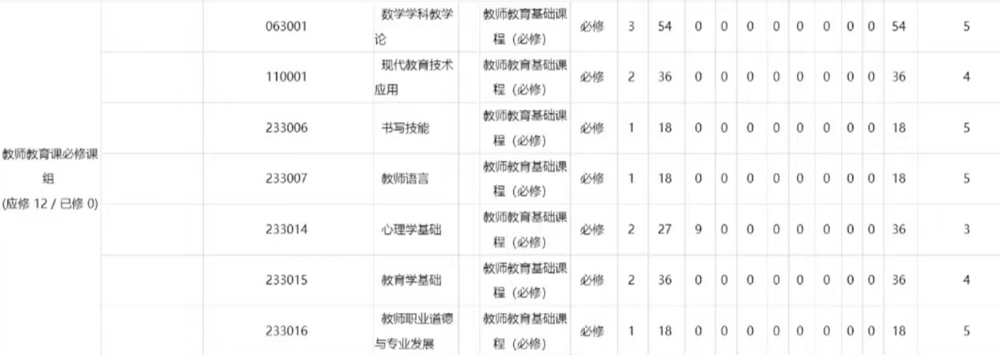
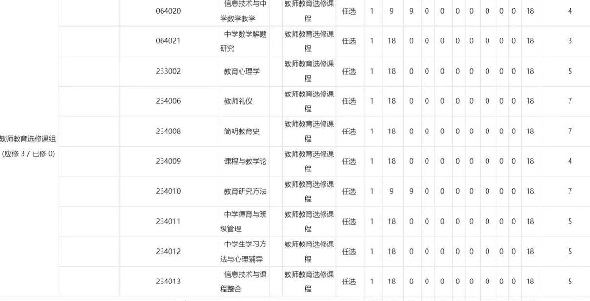

# 教师教育课

!!! quote "作者声明"

    本页内容全部由 21 数学科学学院提供，由 Easy-QFNU 作者加以整理，Easy-QFNU 已得到原作者的授权
    
     本站内容仅供参考，不作为任何建议或意见，如有疑问请联系相关教务老师。

> 注：
>
> 1.   网站作者是非师范本科生，培养计划里没有下述课程，下面内容全部照搬原作者内容，对于数据的更新可能存在延迟，如有错误，请及时 **联系作者** 进行更新。
> 2. 本站内容与原内容相比有删减
> 3. 原作者是数学科学学院的师哥，所以这份资料可能对数学科学学院的同学更适合一些(我猜的)

## 教师教育必修课

该模块课程如上。

这个模块是教师教育必修必修的意思就是上面这些课程大学期间都要 **修完**。七门课大致可以分为三类：

1. 18 周结课，不能提前考试的课：《数学学科教学论》《现代教育技术应用》《心理学基础》

2. 学年下半学期可以提前考试的课：《教育学基础》《教师职业道德与专业发展》

3. 不组织统一考试的考察课：《书写技能》《教师语

### 教师职业道德与专业发展

#### 课程信息

**课程名称**: 教师职业道德

**是否植入**: 未植入

**课程属性**: 教师必修

**结课方式**: 考试

**课时**: 1-9 周，每周两节课

**学分**: 2

**考试时间**: 结课后

**推荐老师**: 孙长远

#### 备注

1. **植入问题**：每个年级每个专业植入哪些课是不确定的。这门课如果大二不选，大三可能植入，也可能到了大三还要自己选。
2. **考试时间**：如果是在学年上半学期选的这门课，考试时间在十八周之后；如果是在学年下半学期选的这门课，考试时间可能在结课后几周，十八周之前（大四下半学期会在十八周结束后离校，没有考试周。这门课考试提前到结课后，是为了部分刚修这门课的大四学生在离校前修完学分，毕竟这是必修课）。
3. **建议**：原作者建议在大二下半学期选这门课。考试时间可能在结课后几周，十八周之前。这样考试周就可以少复习一门课。

### 书写技能

#### 课程信息

**课程名称**: 书写技能

**是否植入**: 未植入

**课程属性**: 教师必修

**结课方式**: 考察

**课时**: 1-6/11-16/1-9/10-18 周，每周两节课

**学分**: 1

**考试时间**: 考察，不统一组织期末考试

**推荐老师**: 无

#### 备注

1. **植入问题**：每个年级每个专业植入哪些课是不确定的。这门课如果大二不选，大三可能植入，也可能到了大三还要自己选。
2. **建议**：当成不考试的考察课就可以。

### 现代教育技术应用

#### 课程信息

**课程名称**: 现代教育技术应用

**是否植入**: 未植入

**课程属性**: 教师必修

**结课方式**: 考试

**课时**: 1-18 周，每周两节课

**学分**: 2

**考试时间**: 十八周之后

**推荐老师**: 轮流授课

#### 备注

1. **植入问题**：每个年级每个专业植入哪些课是不确定的。这门课如果大二不选，大三可能植入，也可能到了大三还要自己选。
2. **考试时间**：不区分学年上下学期，都在十八周之后。
3. **建议**：我建议大二上半学期选这门课。上半学期选一些 18 周的教师必修课，下半学期选可以提前考试的教师必修课，这样下半学期考试周就可以少复习一门课。

### 教育学基础

#### 课程信息

**课程名称**: 教育学基础

**是否植入**: 现植入

**课程属性**: 教师必修

**结课方式**: 考试

**课时**: 1-12 周，每周两节课

**学分**: 2

**考试时间**: 结课后

**推荐老师**:

#### 备注

1. **植入问题**：我当时也是大二下学期植入。提前选是为了防止一学期内考试课程过多。
2. **考试时间**：如果是在学年上半学期选的这门课，考试时间在十八周之后；如果是在学年下半学期选的这门课，考试时间可能在结课后几周，十八周之前（大四下半学期会在十八周结束后离校，没有考试周。这门课考试提前到结课后，是为了部分刚修这门课的大四学生在离校前修完学分）。
3. **建议**：大二下半学期上这门课。考试时间可能在结课后几周，十八周之前。这样考试周就可以少复习一门课。

### 心理学基础

#### 课程信息

**课程名称**: 心理学基础  
**是否植入**: 现植入  
**课程属性**: 教师必修  
**结课方式**: 考试  
**课时**: 1-18 周，每周两节课  
**学分**: 2  
**考试时间**: 十八周之后  
**推荐老师**: 流水阅卷

#### 备注

1. **植入问题**：我当时不植入，任选。现在课程安排调整了，上半学期开设少量课程供高年级补修，开课主力在这学期，植入了。
2. **考试时间**：之前是 1-12 周课，每周三节课，可以提前考试。现在调整为 1-18 周课，每周两节课，不再区分学年上下学期，都在十八周之后。
3. **课本**：课本不一定用右边这本。

### 教师语言

#### 课程信息

**课程名称**: 教师语言  
**是否植入**: 未开课  
**课程属性**: 教师必修  
**结课方式**: 考察  
**课时**: 1-9 周，每周两节课  
**学分**: 1  
**考试时间**: 考察，不统一组织期末考试  
**推荐老师**:

#### 备注

1. **植入问题**：根据以往的开课情况，这门课仅在每个学年的上半学期植入，学院一直是等到大三上半学期植入。
2. **建议**：当成不考试的考察课就可以。

### 数学学科教学论

#### 课程信息

**课程名称**: 数学学科教学论

**是否植入**: 植入

**课程属性**: 教师必修

**结课方式**: 考试

**课时**: 1-18 周，每周两节课

**学分**: 3

**考试时间**: 十八周之后

**推荐老师**:

#### 备注

1. **植入问题**：这是学院自行开设的课程，目前植入。
2. **考试时间**：不区分学年上下学期，都在十八周之后。

### 结语

教师必修课真的很重要。

往小了说，24 下半年的教资考试的很多内容，其实教师必修课程里面已经讲过了。再学教资的时候就比较轻松。以后就业考教师编，也有很多重合的内容。甚至考研考教育学也不会脱离这部分。

往大了说，教师教育课程是在从最基础、最基本的地方开始将我们培养成一名合格的教师预备役。这是我们步入社会前必不可少的学习环节。

所以这部分课程要认真学。即使真的听不进去，期末的时候也认真背，至少背了不会白费。

## 教师教育选修课

这个模块应修 3 学分，每门课 1 学分。也就是说这个模块要修三门课。

选课建议：该模块课程修够三门，不需要完全按照课程设置总表的计划学期选课。

下表是目前的开课情况

| 课程名称                 | 开课情况       | 上课时间 |
| ------------------------ | -------------- | -------- |
| 信息技术与中学数学教学   | 不开课         |          |
| 中学数学解题研究         | 不开课         |          |
| 教育心理学               | 开课           | 1-9 周    |
| 教师礼仪                 | 不开课         |          |
| 简明教育史               | 开课           | 1-9 周    |
| 课程与教学论             | 开课           | 1-9 周    |
| 教育研究方法             | 开课           | 1-9 周    |
| 中学德育与班级管理       | 开课           | 1-9 周    |
| 中学生学习方法与心理辅导 | 曲阜校区不开课 |          |
| 信息技术与课程整合       | 曲阜校区不开课 |          |
