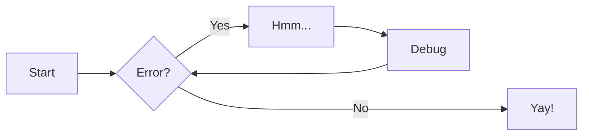
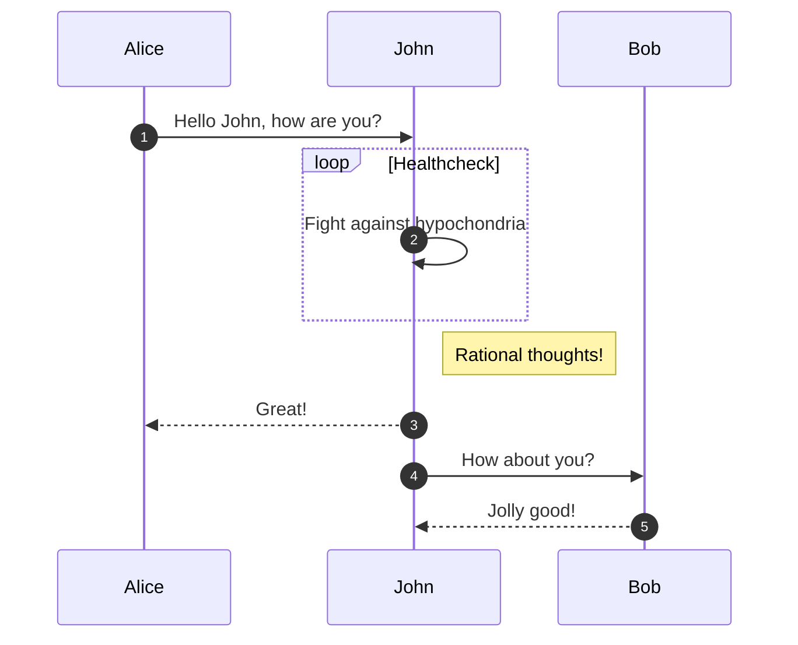
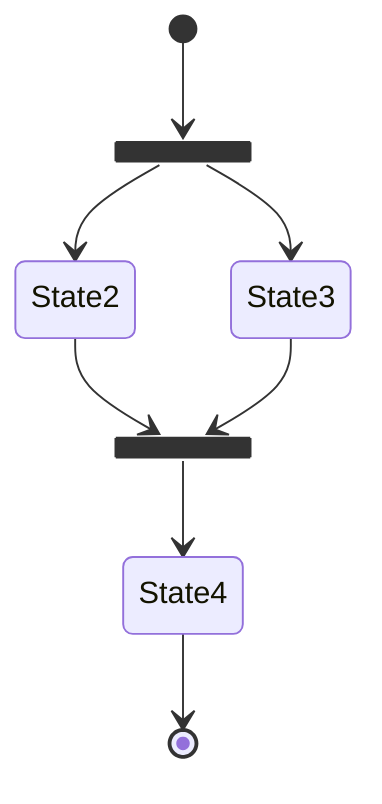
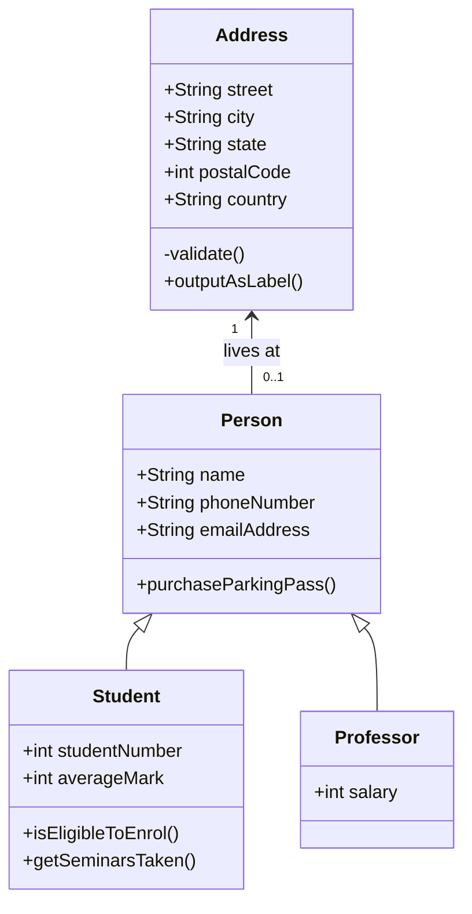
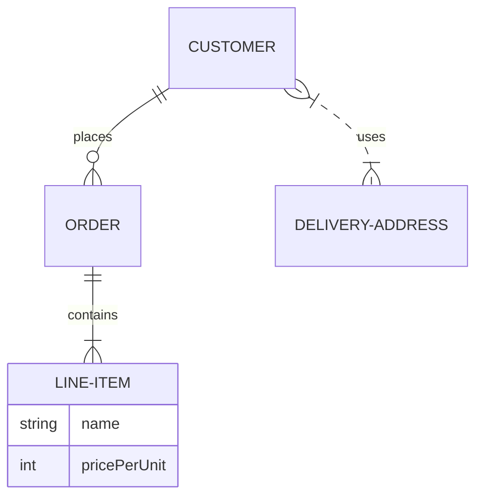

# 贡献指南之高级语法 | Advanced Syntax

<font color="red">**本文的所有写法的样式都适配 Markdown 的基本语法，请务必阅读相关语法文档。**</font>

## 粗体斜体测试

```
**粗体** _斜体_
```

<div class="result" markdown>

**粗体** _斜体_

</div>

---

## 智能符号

```
(tm)

(c)

(r)

c/o

+/-

-->

<--

<-->

=/=

1/4, etc.

1st 2nd etc.
```

<div class="result" markdown>

(tm)

(c)

(r)

c/o

+/-

-->

<--

<-->

=/=

1/4, etc.

1st 2nd etc.

</div>

---

## 选项卡

[https://facelessuser.github.io/pymdown-extensions/extensions/tabbed/#tabbed](https://facelessuser.github.io/pymdown-extensions/extensions/tabbed/#tabbed)

### 常见的

```
=== "列表1"

    Markdown **内容**.

    测试段落.

=== "列表 2"

    More Markdown **内容**.

    - 列表 a
    - 列表 b
```

<div class="result" markdown>

=== "列表 1"

    Markdown **内容**.

    测试段落.

=== "列表 2"

    More Markdown **内容**.

    - 列表 a
    - 列表 b

</div>

---

### 阻断连续

在极少数情况下，您希望紧接着两个单独的选项卡集，您可以使用`!`显式标记新选项卡集的开始

```
===! "列表 A"

    测试文本.

=== "列表 B"

    `更多内容.`

===! "列表 C"

    测试文本.

=== "列表 D"

    `更多内容.`

```

<div class="result" markdown>

===! "列表 A"

    测试文本.

=== "列表 B"

    `更多内容.`

===! "列表 C"

    测试文本.

=== "列表 D"

    `更多内容.`

</div>

---

### 指定默认选择

```

=== "Not Me"

    Markdown **内容**.

        测试段落.

===+ "Select Me"

    More Markdown **内容**.

        - 列表 a
        - 列表 b

=== "Not Me Either"

    另一个 列表

```

<div class="result" markdown>

=== "Not Me"

    Markdown **内容**.

    测试段落.

===+ "Select Me"

    More Markdown **内容**.

    - 列表 a
    - 列表 b

=== "Not Me Either"

    另一个 列表

</div>

---

## 警告框

[https://squidfunk.github.io/mkdocs-material/reference/admonitions](https://squidfunk.github.io/mkdocs-material/reference/admonitions/)

定制化：[https://squidfunk.github.io/mkdocs-material/reference/admonitions/#custom-admonitions](https://squidfunk.github.io/mkdocs-material/reference/admonitions/#custom-admonitions)

```
!!! note "笔记"

    默认样式
```

<div class="result" markdown>

!!! note "笔记"

    默认样式

</div>

---

```
!!! abstract ""

    无标题样式
```

<div class="result" markdown>

!!! abstract ""

    无标题样式

</div>

---

```
??? info "信息"

    折叠样式
```

<div class="result" markdown>

??? info "信息"

    折叠样式

</div>

---

```
???+ tip "提示"

    折叠默认打开样式
```

<div class="result" markdown>

???+ tip "提示"

    折叠默认打开样式

</div>

---

```
=== "右对齐"

    注意左右对齐，附属的文字一定要在对齐样式下方，才能实现左右对齐，否则会显示在框的上方

    !!! success inline end "成功"

        右对齐样式

    这是一个右对齐样式

=== "左对齐"

    注意左右对齐，附属的文字一定要在对齐样式下方，才能实现左右对齐，否则会显示在框的上方

    !!! question inline "问题"

        左对齐样式

    这是一个左对齐样式
```

<div class="result" markdown>

=== "右对齐"

    注意左右对齐，附属的文字一定要在对齐样式下方，才能实现左右对齐，否则会显示在框的上方

    !!! success inline end "成功"

        右对齐样式

    这是一个右对齐样式

=== "左对齐"

    注意左右对齐，附属的文字一定要在对齐样式下方，才能实现左右对齐，否则会显示在框的上方

    !!! question inline "问题"

        左对齐样式

    这是一个左对齐样式

</div>

---

```
!!! pied-piper "定制样式 Pied Piper"

    定制样式测试
```

<div class="result" markdown>

!!! pied-piper "定制样式 Pied Piper"

    定制样式测试

</div>

---

### 注释

#### 默认注释

```
这是一个注释 (1) 。
{.annotate}

1. 我是一个注释 :man_raising_hand:
```

<div class="result" markdown>

这是一个注释 (1) 。
{.annotate}

1. 我是一个注释 :man_raising_hand:

</div>

#### 嵌套注释

```
嵌套注释 (1)
{ .annotate }

1.  我是一个嵌套注释 (1) :man_raising_hand:
    { .annotate }

    1.  我是嵌套注释的子注释 :man_raising_hand:
```

<div class="result" markdown>

嵌套注释 (1)
{ .annotate }

1.  我是一个嵌套注释 (1) :man_raising_hand:
    { .annotate }

    1.  我是嵌套注释的子注释 :man_raising_hand:

</div>

---

#### 提示框注释

```
!!! note annotate "注释(1)"

    我是一个注释(2)

1. 我是一个注释 :man_raising_hand:
2. 我是一个注释 :man_raising_hand:
```

<div class="result" markdown>

!!! note annotate "注释(1)"

    我是一个注释(2)

1. 我是一个注释 :man_raising_hand:
2. 我是一个注释 :man_raising_hand:

</div>

---

#### 选项卡注释

```
=== "列表 1"

    选项卡注释1(1)
    {.annotate}

    1. 选项卡注释1 :man_raising_hand:

=== "列表 2"

    选项卡注释2(1)
    {.annotate}

    1. 选项卡注释2 :man_raising_hand:
```

<div class="result" markdown>

=== "列表 1"

    选项卡注释1(1)
    {.annotate}

    1. 选项卡注释1 :man_raising_hand:

=== "列表 2"

    选项卡注释2(1)
    {.annotate}

    1. 选项卡注释2 :man_raising_hand:

</div>

---

#### HTML 包装任意元素

```
可以用 div 把任何元素包裹起来，这样就可以添加任意的样式的注释（特例除外）

<div class="annotate" markdown>

> 后面有一个注释(1)

</div>

---

1. 我是一个注释 :man_raising_hand:
```

<div class="result" markdown>

可以用 div 把任何元素包裹起来，这样就可以添加任意的样式的注释（特例除外）

<div class="annotate" markdown>

> 后面有一个注释(1)

</div>

1. 我是一个注释 :man_raising_hand:

</div>

---

## 按钮

### 默认按钮

```
[回到顶部](#){: .md-button }
```

<div class="result" markdown>

[回到顶部](#){: .md-button }

</div>

---

### 填充色按钮

```
[回到顶部(填充色)](#){ .md-button .md-button--primary }
```

<div class="result" markdown>

[回到顶部(填充色)](#){ .md-button .md-button--primary }

</div>

---

### 带图标按钮

```
[发送:fontawesome-solid-paper-plane:](<javascript:alert$.next("测试成功")>){ .md-button }
```

<div class="result" markdown>

[发送:fontawesome-solid-paper-plane:](<javascript:alert$.next("测试成功")>){ .md-button }

</div>

---

## 代码块

### 默认代码块

````
    ```python
    print("hello world!")
    ```

````

<div class="result" markdown>

```python
print("hello world!")
```

</div>

---

### 添加标题代码块

````
    ```Python title="自定义标题"
    print("hello world!")
    ```
````

<div class="result" markdown>

```Python title="自定义标题"
print("hello world!")
```

</div>

---

### 添加注释代码块

````
    ```yaml
    theme:
    features:
        - content.code.annotate #这是一个注释(1)
    ```

    1. 注释:man_raising_hand:
````

<div class="result" markdown>

```yaml
theme:
features:
  - content.code.annotate #这是一个注释(1)
```

1. 注释:man_raising_hand:

</div>

---

### 添加注释代码块（剥离注释）

````
    ```py
    print("hello world!") #这是一个注释(1)!
    ```

    1. 剥离的注释:man_raising_hand:
````

<div class="result" markdown>

```py
print("hello world!") #这是一个注释(1)!
```

1. 剥离的注释:man_raising_hand:

</div>

---

### 添加行号

````
    ```py linenums="99999"
    print("hello world!")
    ```
````

<div class="result" markdown>

```py linenums="99999"
print("hello world!")
```

</div>

---

### 突出显示特定行

#### 代码块行号

````
    ```py hl_lines="2 3"
    def bubble_sort(items):
        for i in range(len(items)):
            for j in range(len(items) - 1 - i):
                if items[j] > items[j + 1]:
                    items[j], items[j + 1] = items[j + 1], items[j]
    ```
````

<div class="result" markdown>

```py hl_lines="2 3"
def bubble_sort(items):
    for i in range(len(items)):
        for j in range(len(items) - 1 - i):
            if items[j] > items[j + 1]:
                items[j], items[j + 1] = items[j + 1], items[j]
```

</div>

---

#### 代码块行号(行号范围)

````
    ```py hl_lines="3-5"
    def bubble_sort(items):
        for i in range(len(items)):
            for j in range(len(items) - 1 - i):
                if items[j] > items[j + 1]:
                    items[j], items[j + 1] = items[j + 1], items[j]
    ```
````

<div class="result" markdown>

```py hl_lines="3-5"
def bubble_sort(items):
    for i in range(len(items)):
        for j in range(len(items) - 1 - i):
            if items[j] > items[j + 1]:
                items[j], items[j + 1] = items[j + 1], items[j]
```

</div>

---

### 突出显示内联代码块

```
The `#!python range()` function is used to generate a sequence of numbers.
```

<div class="result" markdown>

The `#!python range()` function is used to generate a sequence of numbers.

</div>

---

### 嵌入外部文件

这里写源代码的时候需要把第二行两边的顿号去掉

````
```title="嵌入测试"
`--8<-- "docs/嵌入测试.md"`
```
````

<div class="result" markdown>

```title="嵌入测试"
--8<-- "docs/嵌入测试.md"
```

</div>

---

## 分组

### 分组代码块

````
=== "C"

    ``` c
    #include <stdio.h>

    int main(void) {
      printf("Hello world!\n");
      return 0;
    }
    ```

=== "C++"

    ``` c++
    #include <iostream>

    int main(void) {
      std::cout << "Hello world!" << std::endl;
      return 0;
    }
    ```
````

<div class="result" markdown>

=== "C"

    ``` c
    #include <stdio.h>

    int main(void) {
      printf("Hello world!\n");
      return 0;
    }
    ```

=== "C++"

    ``` c++
    #include <iostream>

    int main(void) {
      std::cout << "Hello world!" << std::endl;
      return 0;
    }
    ```

</div>

---

### 其他内容分组

```
=== "无序列表"

    * Sed sagittis eleifend rutrum
    * Donec vitae suscipit est
    * Nulla tempor lobortis orci

=== "有序列表"

    1. Sed sagittis eleifend rutrum
    2. Donec vitae suscipit est
    3. Nulla tempor lobortis orci
```

<div class="result" markdown>

=== "无序列表"

    * Sed sagittis eleifend rutrum
    * Donec vitae suscipit est
    * Nulla tempor lobortis orci

=== "有序列表"

    1. Sed sagittis eleifend rutrum
    2. Donec vitae suscipit est
    3. Nulla tempor lobortis orci

</div>

---

### 嵌入内容

```
!!! example

    === "无序列表"

        * Sed sagittis eleifend rutrum
        * Donec vitae suscipit est
        * Nulla tempor lobortis orci

    === "有序列表"

        1. Sed sagittis eleifend rutrum
        2. Donec vitae suscipit est
        3. Nulla tempor lobortis orci
```

<div class="result" markdown>

!!! example

    === "无序列表"

        * Sed sagittis eleifend rutrum
        * Donec vitae suscipit est
        * Nulla tempor lobortis orci

    === "有序列表"

        1. Sed sagittis eleifend rutrum
        2. Donec vitae suscipit est
        3. Nulla tempor lobortis orci

</div>

---

## 数据表

### 默认数据表

```
| Method   | Description                          |
| -------- | ------------------------------------ |
| `GET`    | :material-check: Fetch resource      |
| `PUT`    | :material-check-all: Update resource |
| `DELETE` | :material-close: Delete resource     |
```

<div class="result" markdown>

| Method   | Description                          |
| -------- | ------------------------------------ |
| `GET`    | :material-check: Fetch resource      |
| `PUT`    | :material-check-all: Update resource |
| `DELETE` | :material-close: Delete resource     |

</div>

---

### 列对齐数据表

```
=== "Left"

    | Method   | Description                          |
    | :------- | :----------------------------------- |
    | `GET`    | :material-check:     Fetch resource  |
    | `PUT`    | :material-check-all: Update resource |
    | `DELETE` | :material-close:     Delete resource |

=== "Center"

    |  Method  |             Description              |
    | :------: | :----------------------------------: |
    |  `GET`   | :material-check:     Fetch resource  |
    |  `PUT`   | :material-check-all: Update resource |
    | `DELETE` | :material-close:     Delete resource |

=== "Right"

    |   Method |                          Description |
    | -------: | -----------------------------------: |
    |    `GET` |  :material-check:     Fetch resource |
    |    `PUT` | :material-check-all: Update resource |
    | `DELETE` | :material-close:     Delete resource |
```

<div class="result" markdown>

=== "Left"

    | Method   | Description                          |
    | :------- | :----------------------------------- |
    | `GET`    | :material-check:     Fetch resource  |
    | `PUT`    | :material-check-all: Update resource |
    | `DELETE` | :material-close:     Delete resource |

=== "Center"

    |  Method  |             Description              |
    | :------: | :----------------------------------: |
    |  `GET`   | :material-check:     Fetch resource  |
    |  `PUT`   | :material-check-all: Update resource |
    | `DELETE` | :material-close:     Delete resource |

=== "Right"

    |   Method |                          Description |
    | -------: | -----------------------------------: |
    |    `GET` |  :material-check:     Fetch resource |
    |    `PUT` | :material-check-all: Update resource |
    | `DELETE` | :material-close:     Delete resource |

</div>

---

## mermaid 图

### 流程图

````

````

<div class="result" markdown>


</div>

### 时序图

````

````

<div class="result" markdown>


</div>

---

### 状态图

````

````

<div class="result" markdown>


</div>

---

### 类图

````

````

<div class="result" markdown>


</div>

---

### 实体关系图

````

````

<div class="result" markdown>


</div>

---

## 其他图

除了上面列出的 mermaid 图类型之外，Mermaid.js 还提供对饼图、甘特图、用户旅程、git 图和需求图的支持，所有这些都未得到 Material for MkDocs 的正式支持。 这些 mermaid 图应该仍然像 Mermaid.js 所宣传的那样工作，但我们不认为它们是一个好的选择，主要是因为它们在移动设备上工作得不好。

## 脚注

### 默认脚注

#### 脚注正文文字

```
Lorem ipsum[^1] dolor sit amet, consectetur adipiscing elit.[^2]
```

<div class="result" markdown>

Lorem ipsum[^1] dolor sit amet, consectetur adipiscing elit.[^2]

</div>

#### 添加脚注

```
[^1]: Lorem ipsum dolor sit amet, consectetur adipiscing elit.
[^2]:
    Lorem ipsum dolor sit amet, consectetur adipiscing elit. Nulla et euismod
    nulla. Curabitur feugiat, tortor non consequat finibus, justo purus auctor
    massa, nec semper lorem quam in massa.
```

<div class="result" markdown>

[^1]: Lorem ipsum dolor sit amet, consectetur adipiscing elit.
[^2]: Nulla et euismod nulla. Curabitur feugiat, tortor non consequat finibus, justo purus auctor massa, nec semper lorem quam in massa.

</div>

---

## 格式化

### 标记测试

```
==标记我==

^^下划线^^

上标^上^

- H~2~O
- A^T^A
```

<div class="result" markdown>

==标记我==

^^下划线^^

上标^上^

- H~2~O
- A^T^A

</div>

---

### 增删建议

```
文本可以是 {--已删除--} 和替换文本 {++增加++}。 这也可以
组合成 {~~一个~> 另一个~~} 操作。 {==突出显示==}也是
可能的{>> 并且可以内联添加注释 <<}。
```

<div class="result" markdown>

文本可以是 {--已删除--} 和替换文本 {++增加++}。 这也可以
组合成 {~~一个~> 另一个~~} 操作。 {==突出显示==}也是
可能的{>> 并且可以内联添加注释 <<}。

</div>

---

```
{==

格式化也可以通过将开始和结束应用于块
将标签放在单独的行上，并在标签和内容之间添加新行。

==}

- ==This was marked==
- ^^This was inserted^^
- ~~This was deleted~~
```

<div class="result" markdown>

{==

格式化也可以通过将开始和结束应用于块
将标签放在单独的行上，并在标签和内容之间添加新行。

==}

- ==This was marked==
- ^^This was inserted^^
- ~~This was deleted~~

</div>

---

### 键盘按键

```
++ctrl+alt+del++
```

<div class="result" markdown>

++ctrl+alt+del++

</div>

---

## 网格

### 列表语法

```
<div class="grid cards" markdown>

- :fontawesome-brands-html5: **HTML** 内容和结构
- :fontawesome-brands-js: **JavaScript** 用于交互
- :fontawesome-brands-css3: **CSS** 文本样式
- :fontawesome-brands-internet-explorer: **Internet Explorer** ... 嗯？

</div>
```

<div class="result" markdown>

<div class="grid cards" markdown>

- :fontawesome-brands-html5: **HTML** 内容和结构
- :fontawesome-brands-js: **JavaScript** 用于交互
- :fontawesome-brands-css3: **CSS** 文本样式
- :fontawesome-brands-internet-explorer: **Internet Explorer** ... 嗯？

</div>

</div>

---

### 更复杂的列表

注：此处格式化会把语法改错，---改成\*\*\*，缩进后退了一步，需要调整

不建议使用该写法，除非迫不得已

2024 年 4 月 5 日更新，可以通过网格块语法嵌套来抵消格式化带来的麻烦，good! 感谢[Hello-CTF](https://hello-ctf.com/){target="\_blank"}给我带来的灵感

```
<div class="grid cards" markdown>

<div class="grid cards" markdown>
-   :material-clock-fast:{ .lg .middle } __Set up in 5 minutes__

    ---

    Install [`mkdocs-material`](#) with [`pip`](#) and get up
    and running in minutes

    [:octicons-arrow-right-24: Getting started](#)

</div>

<div class="grid cards" markdown>
-   :fontawesome-brands-markdown:{ .lg .middle } __It's just Markdown__

    ---

    Focus on your content and generate a responsive and searchable static site

    [:octicons-arrow-right-24: Reference](#)

</div>

<div class="grid cards" markdown>
-   :material-format-font:{ .lg .middle } __Made to measure__

    ---

    Change the colors, fonts, language, icons, logo and more with a few lines

    [:octicons-arrow-right-24: Customization](#)

</div>

<div class="grid cards" markdown>
-   :material-scale-balance:{ .lg .middle } __Open Source, MIT__

    ---

    Material for MkDocs is licensed under MIT and available on [GitHub]

    [:octicons-arrow-right-24: License](#)

</div>

</div>
```

<div class="result" markdown>
<div class="grid cards" markdown>

<div class="grid cards" markdown>
-   :material-clock-fast:{ .lg .middle } __Set up in 5 minutes__

    ---

    Install [`mkdocs-material`](#) with [`pip`](#) and get up
    and running in minutes

    [:octicons-arrow-right-24: Getting started](#)

</div>

<div class="grid cards" markdown>
-   :fontawesome-brands-markdown:{ .lg .middle } __It's just Markdown__

    ---

    Focus on your content and generate a responsive and searchable static site

    [:octicons-arrow-right-24: Reference](#)

</div>

<div class="grid cards" markdown>
-   :material-format-font:{ .lg .middle } __Made to measure__

    ---

    Change the colors, fonts, language, icons, logo and more with a few lines

    [:octicons-arrow-right-24: Customization](#)

</div>

<div class="grid cards" markdown>
-   :material-scale-balance:{ .lg .middle } __Open Source, MIT__

    ---

    Material for MkDocs is licensed under MIT and available on [GitHub]

    [:octicons-arrow-right-24: License](#)

</div>

</div>

</div>

---

### 块语法

将卡片网格延伸到网格的其他元素混合。

```
<div class="grid" markdown>

:fontawesome-brands-html5: **HTML** for content and structure
{ .card }

:fontawesome-brands-js: **JavaScript** for interactivity
{ .card }

:fontawesome-brands-css3: **CSS** for text running out of boxes
{ .card }

> :fontawesome-brands-internet-explorer: **Internet Explorer** ... huh?

</div>
```

<div class="result" markdown>

<div class="grid" markdown>

:fontawesome-brands-html5: **HTML** for content and structure
{ .card }

:fontawesome-brands-js: **JavaScript** for interactivity
{ .card }

:fontawesome-brands-css3: **CSS** for text running out of boxes
{ .card }

> :fontawesome-brands-internet-explorer: **Internet Explorer** ... huh?

</div>

</div>

---

### 通用网格

这个意思是多种形式的语法都可以嵌套在网格语法内

````
    <div class="grid" markdown>

    === "Unordered list"

        * Sed sagittis eleifend rutrum
        * Donec vitae suscipit est
        * Nulla tempor lobortis orci

    === "Ordered list"

        1. Sed sagittis eleifend rutrum
        2. Donec vitae suscipit est
        3. Nulla tempor lobortis orci

    ```title="Content 列表s"
    === "Unordered list"

        * Sed sagittis eleifend rutrum
        * Donec vitae suscipit est
        * Nulla tempor lobortis orci

    === "Ordered list"

        1. Sed sagittis eleifend rutrum
        2. Donec vitae suscipit est
        3. Nulla tempor lobortis orci
    ```

    </div>
````

<div class="result" markdown>

<div class="grid" markdown>

=== "Unordered list"

    * Sed sagittis eleifend rutrum
    * Donec vitae suscipit est
    * Nulla tempor lobortis orci

=== "Ordered list"

    1. Sed sagittis eleifend rutrum
    2. Donec vitae suscipit est
    3. Nulla tempor lobortis orci

```title="Content 列表s"
=== "Unordered list"

    * Sed sagittis eleifend rutrum
    * Donec vitae suscipit est
    * Nulla tempor lobortis orci

=== "Ordered list"

    1. Sed sagittis eleifend rutrum
    2. Donec vitae suscipit est
    3. Nulla tempor lobortis orci
```

</div>

</div>

---

## 图标、表情符号

### 表情符号

```
emoji 表情 :smile:

图标 :fontawesome-regular-face-laugh-wink:

带颜色的图标 :fontawesome-brands-youtube:{ .youtube }

带动画的图标 :octicons-heart-fill-24:{ .heart }
```

<div class="result" markdown>

emoji 表情 :smile:

图标 :fontawesome-regular-face-laugh-wink:

带颜色的图标 :fontawesome-brands-youtube:{ .youtube }

带动画的图标 :octicons-heart-fill-24:{ .heart }

</div>

---

## 灯箱

### 图像对齐

```
=== "左对齐"

    { align=left }

    “Lorem ipsum dolor sit amet，consectetur adipiscing elit。没有什么是不变的。在紧急情况下，很难找到适合的解决方案，仅此而已。”

=== "右对齐"

    { align=right }

    “Lorem ipsum dolor sit amet，consectetur adipiscing elit。没有什么是不变的。在紧急情况下，很难找到适合的解决方案，仅此而已。”
```

<div class="result" markdown>

=== "左对齐"

    { align=left }

    “Lorem ipsum dolor sit amet，consectetur adipiscing elit。没有什么是不变的。在紧急情况下，很难找到适合的解决方案，仅此而已。”

=== "右对齐"

    { align=right }

    “Lorem ipsum dolor sit amet，consectetur adipiscing elit。没有什么是不变的。在紧急情况下，很难找到适合的解决方案，仅此而已。”

</div>

---

### 图片说明

遗憾的是，Markdown 语法不提供对图像标题的本机支持，但始终可以在 HTML 扩展中使用带有文字 figure 和 figcaption 标签的 Markdown：

```
<figure markdown="span">
  { width="300" }
  <figcaption>Image caption</figcaption>
</figure>
```

<div class="result" markdown>

<figure markdown="span">
  { width="300" }
  <figcaption>Image caption</figcaption>
</figure>

</div>

---

### 图像延迟加载

```
{ loading=lazy }
```

<div class="result" markdown>

{ loading=lazy }

</div>

---

### 深色浅色图片切换

> 暂不需要

```
https://squidfunk.github.io/mkdocs-material/reference/images/#light-and-dark-mode
```

## 列表

### 无序列表

```
- Nulla et rhoncus turpis. Mauris ultricies elementum leo. Duis efficitur
  accumsan nibh eu mattis. Vivamus tempus velit eros, porttitor placerat nibh
  lacinia sed. Aenean in finibus diam.

  - Duis mollis est eget nibh volutpat, fermentum aliquet dui mollis.
  - Nam vulputate tincidunt fringilla.
  - Nullam dignissim ultrices urna non auctor.
```

<div class="result" markdown>

- Nulla et rhoncus turpis. Mauris ultricies elementum leo. Duis efficitur
  accumsan nibh eu mattis. Vivamus tempus velit eros, porttitor placerat nibh
  lacinia sed. Aenean in finibus diam.

  - Duis mollis est eget nibh volutpat, fermentum aliquet dui mollis.
  - Nam vulputate tincidunt fringilla.
  - Nullam dignissim ultrices urna non auctor.

</div>

---

### 有序列表

> 有序列表必须以数字开头，后跟一个点。数字不需要是连续的，可以全部设置为 1.，因为它们在渲染时会重新编号

```
1.  Vivamus id mi enim. Integer id turpis sapien. Ut condimentum lobortis
    sagittis. Aliquam purus tellus, faucibus eget urna at, iaculis venenatis
    nulla. Vivamus a pharetra leo.

    1.  Vivamus venenatis porttitor tortor sit amet rutrum. Pellentesque aliquet
        quam enim, eu volutpat urna rutrum a. Nam vehicula nunc mauris, a
        ultricies libero efficitur sed.

    2.  Morbi eget dapibus felis. Vivamus venenatis porttitor tortor sit amet
        rutrum. Pellentesque aliquet quam enim, eu volutpat urna rutrum a.

        1.  Mauris dictum mi lacus
        2.  Ut sit amet placerat ante
        3.  Suspendisse ac eros arcu
```

<div class="result" markdown>

1.  Vivamus id mi enim. Integer id turpis sapien. Ut condimentum lobortis
    sagittis. Aliquam purus tellus, faucibus eget urna at, iaculis venenatis
    nulla. Vivamus a pharetra leo.

    1.  Vivamus venenatis porttitor tortor sit amet rutrum. Pellentesque aliquet
        quam enim, eu volutpat urna rutrum a. Nam vehicula nunc mauris, a
        ultricies libero efficitur sed.

    2.  Morbi eget dapibus felis. Vivamus venenatis porttitor tortor sit amet
        rutrum. Pellentesque aliquet quam enim, eu volutpat urna rutrum a.

        1.  Mauris dictum mi lacus
        2.  Ut sit amet placerat ante
        3.  Suspendisse ac eros arcu

</div>

---

### 定义列表

一般用不着，且受格式化影响较大。

```
`Lorem ipsum dolor sit amet`

:   Sed sagittis eleifend rutrum. Donec vitae suscipit est. Nullam tempus
    tellus non sem sollicitudin, quis rutrum leo facilisis.

`Cras arcu libero`

:   Aliquam metus eros, pretium sed nulla venenatis, faucibus auctor ex. Proin
    ut eros sed sapien ullamcorper consequat. Nunc ligula ante.

    Duis mollis est eget nibh volutpat, fermentum aliquet dui mollis.
    Nam vulputate tincidunt fringilla.
    Nullam dignissim ultrices urna non auctor.
```

<div class="result" markdown>

`Lorem ipsum dolor sit amet`

: Sed sagittis eleifend rutrum. Donec vitae suscipit est. Nullam tempus
tellus non sem sollicitudin, quis rutrum leo facilisis.

`Cras arcu libero`

: Aliquam metus eros, pretium sed nulla venenatis, faucibus auctor ex. Proin
ut eros sed sapien ullamcorper consequat. Nunc ligula ante.

    Duis mollis est eget nibh volutpat, fermentum aliquet dui mollis.
    Nam vulputate tincidunt fringilla.
    Nullam dignissim ultrices urna non auctor.

</div>

---

### 任务列表

```
- [x] Lorem ipsum dolor sit amet, consectetur adipiscing elit
- [ ] Vestibulum convallis sit amet nisi a tincidunt
  - [x] In hac habitasse platea dictumst
        {: .task-failed }
  - [x] In scelerisque nibh non dolor mollis congue sed et metus
        {: .task-failed }
  - [ ] Praesent sed risus massa
- [ ] Aenean pretium efficitur erat, donec pharetra, ligula non scelerisque
```

<div class="result" markdown>

- [x] Lorem ipsum dolor sit amet, consectetur adipiscing elit
- [ ] Vestibulum convallis sit amet nisi a tincidunt
  - [x] In hac habitasse platea dictumst
        {: .task-failed }
  - [x] In scelerisque nibh non dolor mollis congue sed et metus
        {: .task-failed }
  - [ ] Praesent sed risus massa
- [ ] Aenean pretium efficitur erat, donec pharetra, ligula non scelerisque

</div>

---

x+ {: .task-failed }表示失败

## Mathjax & KaTex 测试

```
$$
\operatorname{ker} f =\{g\in G: f(g)= e_{H}\}{\mbox{.}}
$$

The homomorphism $f$ is injective if and only if its kernel is only the
singleton set $e_G$, because otherwise $\exists a,b\in G$ with $a\neq b$ such
that $f(a)=f(b)$.
```

<div class="result" markdown>

$$
\operatorname{ker} f =\{g\in G: f(g)= e_{H}\}{\mbox{.}}
$$

The homomorphism $f$ is injective if and only if its kernel is only the
singleton set $e_G$, because otherwise $\exists a,b\in G$ with $a\neq b$ such
that $f(a)=f(b)$.

</div>

---

## 工具提示

### 工具提示

```
[Hover me](https://example.com "I'm a tooltip!")
```

<div class="result" markdown>

[Hover me](https://example.com "I'm a tooltip!")

</div>

---

### 工具提示（链接引用）

```
[Hover me][example]

[example]: https://example.com "I'm a tooltip!"
```

<div class="result" markdown>

[Hover me][example]

[example]: https://example.com "I'm a tooltip!"

</div>

---

### 工具提示（带有提示的图标）

```
:material-information-outline:{ title="Important information" }
```

<div class="result" markdown>

:material-information-outline:{ title="Important information" }

</div>

---

### 缩写

```
The HTML specification is maintained by the W3C.

*[HTML]: Hyper Text Markup Language
*[W3C]: World Wide Web Consortium
```

<div class="result" markdown>
The HTML specification is maintained by the W3C.

_[HTML]: Hyper Text Markup Language
_[W3C]: World Wide Web Consortium

</div>

---

### 术语表

术语表的设置路径在 include/abbreviations.md 里面

```
The HTML specification is maintained by the W3C.
```

<div class="result" markdown>

The HTML specification is maintained by the W3C.

</div>

---

### yaml 元数据引用测试

```
<p align="center" markdown>

<a href="{{ social.link }}" name="{{ social.name }}" > :{{ social.icon }}:{ .lg .light } </a>&nbsp; &nbsp;

<br/>
当你看到一大堆图标的时候，就证明测试成功了。
</p>
```

<div class="result" markdown>

<p align="center" markdown>

<a href="{{ social.link }}" name="{{ social.name }}" > :{{ social.icon }}:{ .lg .light } </a>&nbsp; &nbsp;

<br/>
当你看到一大堆图标的时候，就证明测试成功了。
</p>

</div>
