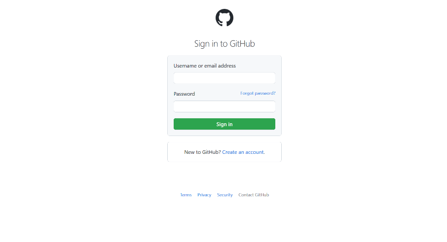

# 食用教程 | Tutorial

## 在开始之前 | Before-you-start

在开始之前，我有必要说一下如何稳定访问 Github 的问题，由于该网站在大陆属于半墙状态，所以有时候我们在国内对这个网站的访问是不稳定的，所以需要通过一些工具来加速，如果你有 VPN 的话，你可以跳过这句话，如果你没有，我推荐你使用[Watt Toolkit](https://steampp.net/#/)「Watt Toolkit」是一个开源跨
平台的多功能 Steam 工具箱。虽然说是加速 Steam 的，但是他也可以加速 Github 的访问，以及网站的使用的一些公共 CDN，谷歌字体，也可以一并加速，所以说实际上，这个工具可以实现对本站的全站加速（但效果不如直接上 VPN 来的好）<strong>有任何疑问都可以**联系作者**</strong>

## 怎么注册 Github 账号？ | How-to-sign-in-Github

> 注意：强烈建议通过某种方法来提高访问 Github 的稳定性，详情可见-->[在开始之前](#before-you-start)

> 本来是我是直接把 CSDN 教程链接扔过来的，考虑到 CSDN 广告弹窗满天飞，影响浏览体验，我直接把原教程搬过来了
>
> 相关链接[https://blog.csdn.net/m0_67906358/article/details/128808210/#/](https://blog.csdn.net/m0_67906358/article/details/128808210/)

1.  打开浏览器，访问 [https://github.com/](https://github.com/){target="\_blank"}

2.  点击右上角的 `Sign up` 按钮

    

3.  输入邮箱，邮箱必须是可以收到邮件的，这个邮箱将会成为你的登录邮箱，然后点击 `Create account` 按钮

    

4.  点击 `Continue`，继续在光标处创建密码，继续创建用户名

5.  进行相应的验证，点击 create account 后 ，会出现这个界面

    

6.  这时邮箱就会收到一封邮件，输入邮件中的数字页面会自动跳转

7.  下面这个根据自身情况进行相应个性化设置，不会影响什么东西

    > 这两个就是问你，你的开发团队有多少规模，你是学生还是教师

    

8.  到这个界面时，GitHub 便创建好了

    

9.  下次登录时，需要点击旁边的 `sign in`，进入登录页面

    

## 怎么发评论？ | How-to-comment?

> 注意：强烈建议通过某种方法来提高访问 Github 的稳定性，详情可见-->[在开始之前](#before-you-start)

### 评论系统介绍 | Comment-system

评论基于 [giscus](https://github.com/giscus/giscus) ，一个基于 GitHub Discussions 的评论系统。

### 在评论开始前 | Before-commenting

首先，上面我们提到了，评论是基于 Github 构建的，所以，你需要先有一个 Github 账号。

Github 账号的注册方法：[如何注册 GitHub 账号](#github-how-to-sign-in-github)

### 评论开始 | Commenting

现在你已经有一个 Github 账号了，接下来，你可以在评论框里输入评论内容，然后点击提交按钮。

如果你无法点击评论或无法打字，那是因为账号未登录，你可以点击评论区的 `使用 Github 登录`来登录。

首次登录可能会需要你授权，一路点击绿色即可。

### 登录之后 | After-Login

登录之后，你就可以进行评论了，评论区支持 Markdown 格式文本

> 相关链接：[Markdown 语法说明（简体中文版）](https://markdown.com.cn/)

### 怎么评论图片/表情包？ | How-to-comment-images/emoji?

Giscus 没有在评论区直接上传图片的功能，但你可以使用 Markdown 语法上传图片。前面我们提到了，Giscus 支持 Markdown 语法

你需要做的只是在评论框里输入``，然后点击提交按钮。

这边的关键点就是如何把图片以链接的形式呈现，开动你的脑筋吧。（图床？直链转换？）

其实还有一种方法，就是直接前往 [Github discussion 评论区](https://github.com/W1ndys/Easy-QFNU/discussions)，直接上传图片。这种方法你需要先随便发一个评论，然后点击该评论的时间跳转过去，然后修改你的评论，加上图片就可以了

### 怎么删除评论/编辑评论？ | How-to-delete/edit-comments?

Giscus 没有在评论区直接删除或修改的功能，但你可以进入 [Github discussion 评论区](https://github.com/W1ndys/Easy-QFNU/discussions) 进行删除或修改。

首先，点击你发出去的评论的`时间`，你就可以在评论区找到你的评论，然后点击`评论右上方的三个点`，就可以修改你的评论了。或者直接删除也可以

最后一个办法（效率最低的办法）：联系站点作者
