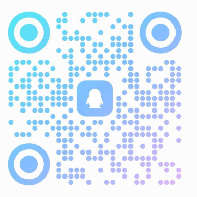

<!--
           .---.     ,---,
          /. ./|  ,`--.' |                  ,---,
      .--'.  ' ; /    /  :      ,---,     ,---.'|
     /__./ \ : |:    |.' '  ,-+-. /  |    |   | :           .--.--.
 .--'.  '   \' .`----':  | ,--.'|'   |    |   | |     .--, /  /    '
/___/ \ |    ' '   '   ' ;|   |  ,"' |  ,--.__| |   /_ ./||  :  /`./
;   \  \;      :   |   | ||   | /  | | /   ,'   |, ' , ' :|  :  ;_
 \   ;  `      |   '   : ;|   | |  | |.   '  /  /___/ \: | \  \    `.
  .   \    .\  ;   |   | '|   | |  |/ '   ; |:  |.  \  ' |  `----.   \
   \   \   ' \ |   '   : ||   | |--'  |   | '/  ' \  ;   : /  /`--'  /
    :   '  |--"    ;   |.'|   |/      |   :    :|  \  \  ;'--'.     /
     \   \ ;       '---'  '---'        \   \  /     :  \  \ `--'---'
      '---"                             `----'       \  ' ;
                                                      `--`   -->

<!-- -------------------------------------------------------------------------------------------------------------------- -->

<!--

%E4%BB%B0%E6%9C%9B%E9%AB%98%E5%B1%B1%E7%9A%84%E4%BA%BA%0A%0A%E4%BB%A5%E4%B8%BA%E5%B1%B1%E5%B7%85%E6%98%AF%E5%B7%8D%E5%B3%A8%E5%B7%85%E5%B3%B0%0A%0A%E5%B3%BB%E5%B3%AD%E3%100%81%E6%8C%BA%E6%8B%94%EF%BC%8C%E6%97%A0%E5%8F%AF%E6%8C%91%E5%89%94%0A%0A%E6%94%100%E7%99%BB%E9%AB%98%E5%B3%B0%E7%9A%84%E4%BA%BA%E6%96%B9%E7%9F%A5%0A%0A%E9%82%A3%E9%87%8C%E6%9C%89%E8%8D%86%E6%A3%98%E3%100%81%E9%99%A9%E6%BB%A9%0A%0A%E8%BF%9C%E4%B8%8D%E6%AD%A2%E7%9C%BC%E5%89%8D%E9%A3%8E%E5%85%89%E4%BF%8F%E4%B8%BD

仰望高山的人

以为山巅是巍峨巅峰

峻峭、挺拔，无可挑剔

攀登高峰的人方知

那里有荆棘、险滩

远不止眼前风光俏丽

-->

<!-- 欲戴皇冠，必承其重。

愿你所有美好，都如约而至。 -->

<!-- 都看到这里了，不考虑考虑加入我们的 contributors 列表吗？ -->

<!-- -------------------------------------------------------------------------------------------------------------------- -->

# 快速开始 | Quick Start

<!-- 下面是随机诗句和公告的切换全部配置 -->
<!-- ——————————————————————————————————————————————————————————————————————————————————————————————————————————————————————————————————————————— -->

<style>
/* CSS样式 */
.shijuannounce {
    display: flex;
    align-items: center; /* 垂直居中 */
    justify-content: center; /* 水平居中 */
}

.content-container {
    position: relative;
    height: 23px; /* 根据内容高度调整 */
    overflow: hidden;
}

.content {
    position: absolute;
    top: 0;
    left: 0;
    width: 100%;
    transition: transform 0.5s ease; /* 调整过渡时间和缓动函数 */
}

/* 取消统计跳转链接文字的默认链接蓝色*/
.md-typeset .custom-link {
    color: inherit; /* 继承父元素的颜色，即默认文本的颜色 */
    text-decoration: none; /* 取消下划线 */
}

</style>

<!-- 诗词一言接口，来自https://www.jinrishici.com/#/ -->
<!-- 生产环境请注释掉，以免过高的访问次数导致封禁IP -->
<!-- 又加了公告切换功能 -->
<div class="grid cards shijuannounce" style="text-align: center">
    <ul>
        <li>
            <div id="content" class="content-container">
                <!-- 随机诗句 -->
                <span id="jinrishici-sentence" class="content">随机诗句加载中</span>
                <script src="https://sdk.jinrishici.com/v2/browser/jinrishici.js" charset="utf-8"></script>
                <!-- 公告 -->
                <span id="announcement" class="content" style="display: none;">欢迎访问Easy-QFNU！</span>
            </div>
        </li>
    </ul>
</div>

<script>
// 切换显示内容
function toggleContent() {
    const jinrishiciSentence = document.getElementById('jinrishici-sentence');
    const announcement = document.getElementById('announcement');

    if (jinrishiciSentence.style.display === 'block') {
        jinrishiciSentence.style.transform = 'translateY(-100%)';
        announcement.style.display = 'block';
        setTimeout(() => {
            announcement.style.transform = 'translateY(0)';
            jinrishiciSentence.style.display = 'none';
        }, 500); // 根据你的过渡时间调整
    } else {
        announcement.style.transform = 'translateY(-100%)';
        jinrishiciSentence.style.display = 'block';
        setTimeout(() => {
            jinrishiciSentence.style.transform = 'translateY(0)';
            announcement.style.display = 'none';
        }, 500); // 根据你的过渡时间调整
    }
}

// 定时切换内容
setInterval(() => {
    toggleContent();
}, 3200); // 调整切换间隔时间
</script>

<!-- 上面是随机诗句和公告的切换全部配置 -->
<!-- ———————————————————————————————————————————————————————————————————————————————————————————————————————————————————————————————————————————— -->

```title="Easy-QFNU"
 .----------------.  .----------------.  .----------------.  .----------------.  .----------------.  .----------------.  .----------------.  .-----------------.  .----------------.
| .--------------. || .--------------. || .--------------. || .--------------. || .--------------. || .--------------. || .--------------. || .--------------. || .--------------. |
| |  _________   | || |      __      | || |    _______   | || |  ____  ____  | || |              | || |    ___       | || |  _________   | || | ____  _____  | || | _____  _____ | |
| | |_   ___  |  | || |     /  \     | || |   /  ___  |  | || | |_  _||_  _| | || |              | || |  .'   '.     | || | |_   ___  |  | || ||_   \|_   _| | || ||_   _||_   _|| |
| |   | |_  \_|  | || |    / /\ \    | || |  |  (__ \_|  | || |   \ \  / /   | || |    ______    | || | /  .-.  \    | || |   | |_  \_|  | || |  |   \ | |   | || |  | |    | |  | |
| |   |  _|  _   | || |   / ____ \   | || |   '.___`-.   | || |    \ \/ /    | || |   |______|   | || | | |   | |    | || |   |  _|      | || |  | |\ \| |   | || |  | '    ' |  | |
| |  _| |___/ |  | || | _/ /    \ \_ | || |  |`\____) |  | || |    _|  |_    | || |              | || | \  `-'  \_   | || |  _| |_       | || | _| |_\   |_  | || |   \ `--' /   | |
| | |_________|  | || ||____|  |____|| || |  |_______.'  | || |   |______|   | || |              | || |  `.___.\__|  | || | |_____|      | || ||_____|\____| | || |    `.__.'    | |
| |              | || |              | || |              | || |              | || |              | || |              | || |              | || |              | || |              | |
| '--------------' || '--------------' || '--------------' || '--------------' || '--------------' || '--------------' || '--------------' || '--------------' || '--------------' |
 '----------------'  '----------------'  '----------------'  '----------------'  '----------------'  '----------------'  '----------------'  '----------------'  '----------------'
```


欢迎你找到这里，[Easy-QFNU](https://Easy-QFNU.top) 是免费、开源、共建、共享的公益项目，隶属于 [W1ndys](https://github.com/W1ndys) 个人公益项目，致力于让你的 QFNU 更简单~

Easy-QFNU 的前身是 [曲阜师范大学选课指北](https://blog.w1ndys.top/posts/216d9006#/){target ="\_blank "} 和 [曲阜师范大学速通指南](https://blog.w1ndys.top/posts/8f8bbaa8){target ="\_blank "}

## Easy-QFNU

让你的 QFNU 更简单

### Easy-选课

[Easy-选课](/Easy-SelectCourse/){.md-button}
[培养方案](/Easy-SelectCourse/Curriculum/){.md-button}
[选课指北](/Easy-SelectCourse/Selection-Guide/){.md-button}
[选课推荐](/Easy-SelectCourse/Curriculum-Recommend/){.md-button}

Easy-选课的前身是 [曲阜师范大学选课指北](https://blog.w1ndys.top/posts/216d9006#/){target ="\_blank "}，是一个收集汇总选课推荐的 wiki ，帮助你快速找到适合自己的课程。现已合并到 Easy-QFNU 项目中，并增加更多内容。

### Easy-校园

[Easy-校园](/Easy-PassSchool/){.md-button}

Easy-校园的前身是 [曲阜师范大学速通指南](https://blog.w1ndys.top/posts/8f8bbaa8){target ="\_blank "}，是一个收集汇总校园生活常用信息的 wiki ，帮助你快速找到适合自己的信息。现已合并到 Easy-QFNU 项目中，并增加更多内容。

### Easy-学院

[Easy-学院](/Easy-College/){.md-button}

Easy-学院 是 Easy-QFNU 项目产生后新建的一部分，旨在为各学院提供更细致的知识库，帮助同学们更好地了解各学院。欢迎各位学院有识之士投稿，共建知识库。

## 关于本站 | About

- 官网：[https://easy-qfnu.top](https://easy-qfnu.top) 你可以在下方代码块后方直接复制以便于分享

  ```title="官网"
  https://easy-qfnu.top
  ```

- 项目地址：[https://github.com/W1ndys/Easy-QFNU](https://github.com/W1ndys/Easy-QFNU)

### 联系作者 ｜ Contact

- 作者：[W1ndys](https://github.com/W1ndys)

- 邮箱：[w1ndys@outlook.com](mailto:w1ndys@outlook.com) (作者个人邮箱，可以直接联系)

- QQ：[2769731875](https://qm.qq.com/q/UK4JFydS8y) (作者 QQ 号，可以直接联系，联系请注明来意)

- 微信公众号：[W1ndys](#contact-微信公众号) (关注公众号，获取最新资讯，有重要通知都会在这里发)

=== "官网"

    

    官方网站的二维码，扫一下即可跳转到官方网站页面，可以截图分享

=== "微信公众号"

    

    我们的微信公众号，关注后可以获取最新资讯，有重要通知都会在这里发

=== "作者 QQ"

    

    需要 **联系作者** 请扫描二维码联系，请一定备注来源

=== "官方抖音号"

    

=== "QQ 通知群"

    

=== "QQ 闲聊群"

    

    来水群！来水群！来水群！来水群！
