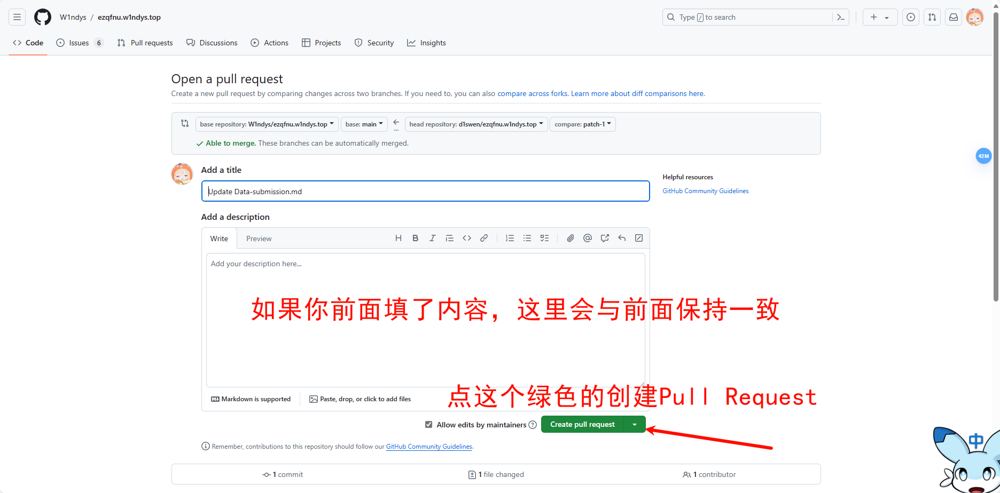
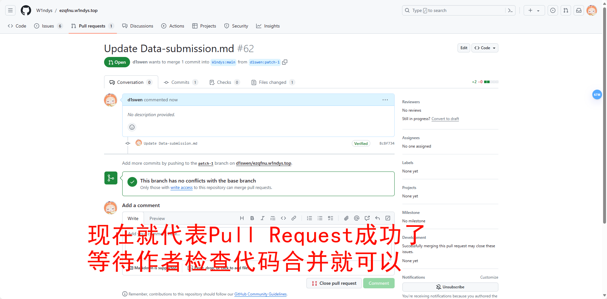

# 数据提交

- [Pull request](#pull-request)(适合源代码工作者)

- [问卷提交](#_2)(适合大多数人)

- [联系作者](#_3)(适合问卷无法描述的内容)

## Pull request

> 推荐会 pr 的同学使用这种方法，方便快捷，有多端 bot 检查语法，自动化，工作效率高
> 通过 pr 参与编辑的 GitHub 用户可以加入到[`官方文档的贡献者`](https://github.com/W1ndys/ezqfnu.w1ndys.top/graphs/contributors/){target="\_blank" rel="noopener"}中，成为源代码仓库编辑的一员

> 注意：直接参与源代码编辑你需要<abbr title="Markdown是一种轻量级标记语言，它允许人们使用易读易写的纯文本格式编写文档，然后转换成格式丰富的HTML页面。">Markdown</abbr>语法、少量<abbr title="HTML是一种用于创建网页的标准标记语言。">HTML</abbr>语法的基础知识

> 什么是 Markdown？答：[Markdown 教程](https://markdown.com.cn/)

<blockquote style="text-align:right">
学习 Markdown 语法<strong>并不需要很长时间</strong>，一旦你知道如何使用它，你就可以在几乎所有地方使用  
</blockquote>
> 
———— Markdown 官方文档

> 什么是 HTML？答：[HTML 教程](https://www.w3school.com.cn/html/index.asp)

> 但如果你很想通过 Pull Request 来直接参与编辑，又不了解 Markdown、HTML 的语法，请[联系项目作者](#_3)，我很乐意与他人技术交流，<strong>即使是很简单的问题</strong>

操作方法：在每一页可以编辑的页面右上角都有一个`铅笔头`:material-pencil:的编辑图标，点击图标即可跳转到编辑页面(由于是 GitHub 仓库页面，可能需要你进行<abbr title="魔法，更通俗来说就是加速访问Github的工具，这种工具叫做VPN">一些操作</abbr>保证页面的稳定访问)

### 1.fork 仓库

点击图标之后，登录你的 Github 账号，如果你从未参与过编辑，你会看到如下页面

点击绿色的按钮 fork 到你的仓库之后，开始编辑

### 2.编辑源代码

编辑完成之后，点击右上方的绿色按钮保存

### 3.提交

填写你改动了什么，然后点击右下角的绿色按钮提交

出现下面这个页面就代表 Pull Request 成功，下面可能会有部署机器人的评论，不需要你管，等待源代码仓库拥有者合并就可以。

<figure markdown="span">
    
    <figcaption>等待合并</figcaption>
</figure>

## 问卷提交

:simple-googlebard: [我有推荐的老师](https://wj.qq.com/s2/12987247/cca3/)
{.card}

:material-mother-heart: [我有其他想提交的内容](https://wj.qq.com/s2/14427061/19b8/)
{.card}

## 联系作者

- :material-mail: 给我[发邮箱](mailto:w1ndys@outlook.com)

- :material-qqchat: [点击此处](https://qm.qq.com/q/jxkXeydtoA){target="\_blank" rel="noopener"}加我为 QQ 好友

---

:material-clock-edit-outline:{ title="修改日期" } 2024-04-04
:material-clock-plus-outline:{ title="创建日期" } 2024-03-27
