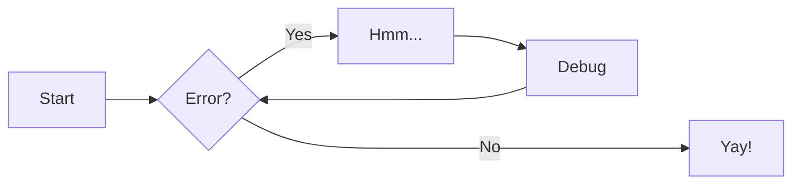
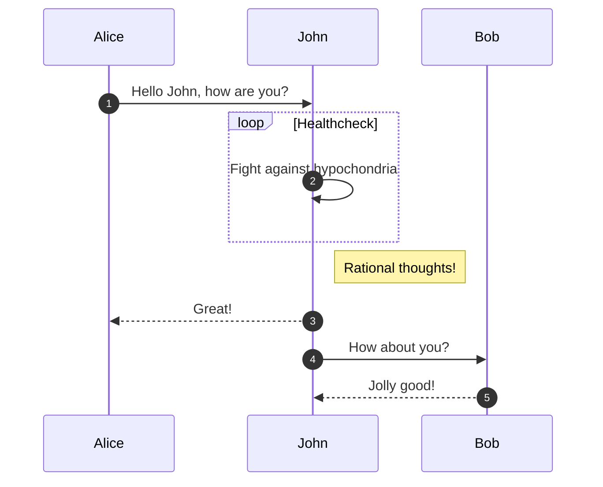
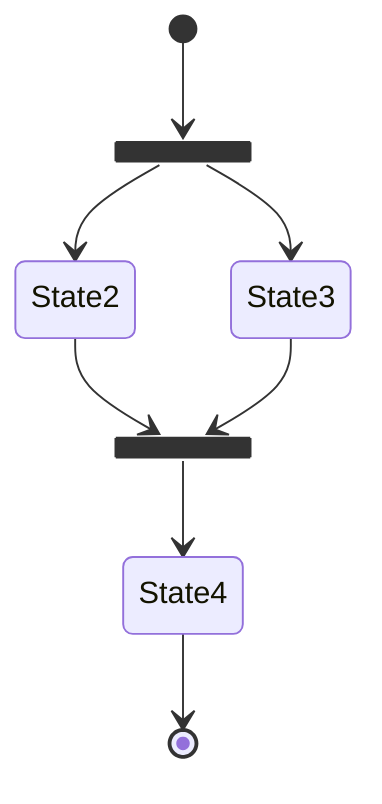
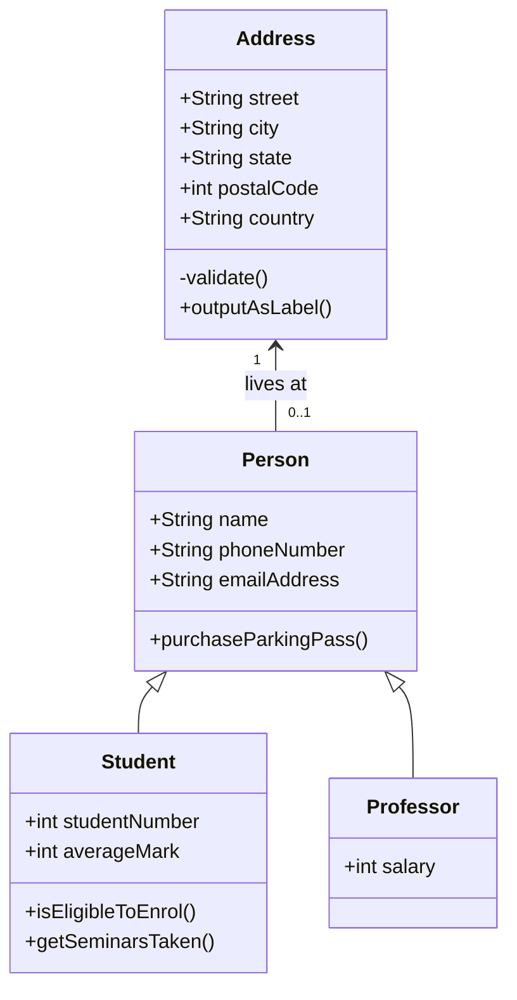
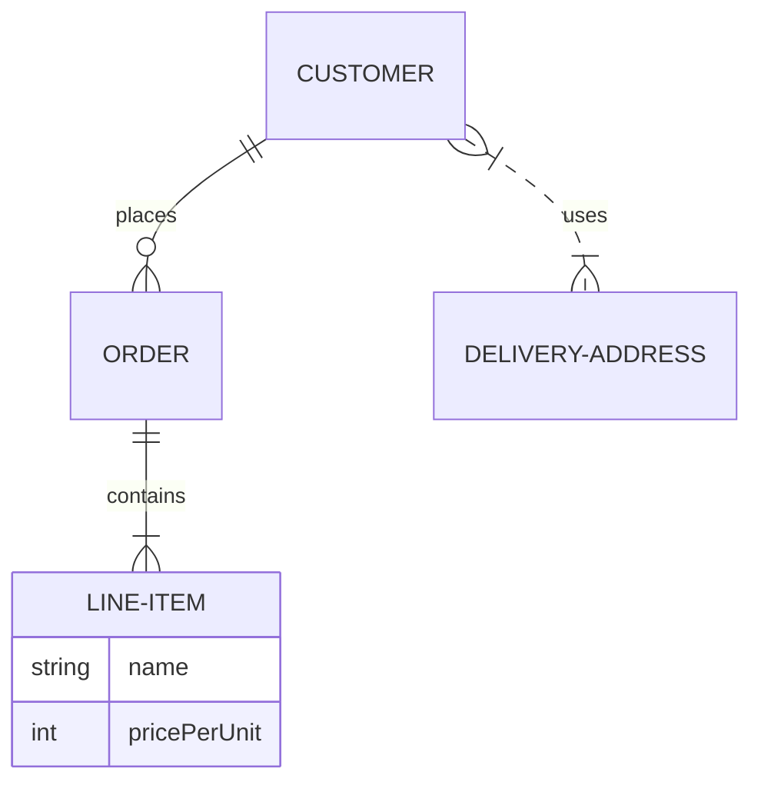

# 测试页面

## Mathjax & KaTex 测试

$$
\operatorname{ker} f =\{g\in G: f(g)= e_{H}\}{\mbox{.}}
$$

The homomorphism $f$ is injective if and only if its kernel is only the
singleton set $e_G$, because otherwise $\exists a,b\in G$ with $a\neq b$ such
that $f(a)=f(b)$.

## 粗体斜体测试

**粗体** _斜体_

## 标记测试

==标记我==

^^下划线^^

上标^上^

- H~2~O
- A^T^A

## 增删建议

文本可以是 {--已删除--} 和替换文本 {++增加++}。 这也可以
组合成 {~~一个~> 另一个~~} 操作。 {==突出显示==}也是
可能的{>> 并且可以内联添加注释 <<}。

{==

格式化也可以通过将开始和结束应用于块
将标签放在单独的行上，并在标签和内容之间添加新行。

==}

- ==This was marked==
- ^^This was inserted^^
- ~~This was deleted~~

## 键盘按键

++ctrl+alt+del++

## 智能符号

(tm)

(c)

(r)

c/o

+/-

-->

<--

<-->

=/=

1/4, etc.

1st 2nd etc.

## 术语表

The HTML specification is maintained by the W3C.

## 嵌入外部文件

--8<-- "docs/嵌入测试.md"

--8<--
docs/嵌入测试.md
--8<--

## 图

### 流程图



### 序列图



### 状态图



### 类图



### 实体关系图



除了上面列出的图表类型之外，Mermaid.js 还提供对饼图、甘特图、用户旅程、git 图和需求图的支持，所有这些都未得到 Material for MkDocs 的正式支持。 这些图表应该仍然像 Mermaid.js 所宣传的那样工作，但我们不认为它们是一个好的选择，主要是因为它们在移动设备上工作得不好。

## 选项卡

### 常见的

=== "Tab 1"
Markdown **content**.

    Multiple paragraphs.

=== "Tab 2"
More Markdown **content**.

    - list item a
    - list item b

### 连续两个

=== "Tab 1"
Markdown **content**.

    Multiple paragraphs.

=== "Tab 2"
More Markdown **content**.

    - list item a
    - list item b

===! "Tab A"
Different tab set.

=== "Tab B"
`More content.`

### 指定指定默认选择

=== "Not Me"
Markdown **content**.

    Multiple paragraphs.

===+ "Select Me"
More Markdown **content**.

    - list item a
    - list item b

=== "Not Me Either"
Another Tab

### 选项卡 ID

ID

=== "tab"
content

## 任务列表

Task List

- [x] item 1
  - [x] item A
  - [ ] item B
        more text
    - [x] item a
    - [ ] item b
    - [x] item c
  - [x] item C
- [ ] item 2
- [ ] item 3

## 云上曲园

云上曲园

## 警告

!!! note "笔记"

    默认样式

!!! abstract ""

    无标题样式

??? info "信息"

    折叠样式

???+ tip "提示"

    折叠默认打开样式

=== "右对齐"

    注意左右对齐，附属的文字一定要在对齐样式下方，才能实现左右对齐，否则会显示在框的上方

    !!! success inline end "成功"
        右对齐样式
    这是一个右对齐样式

=== "左对齐"

    注意左右对齐，附属的文字一定要在对齐样式下方，才能实现左右对齐，否则会显示在框的上方

    !!! question inline "问题"
        左对齐样式
    这是一个左对齐样式

!!! pied-piper "定制样式 Pied Piper"

    定制样式测试

### 注释

#### 默认注释

这是一个注释 (1) 。
{.annotate}

1. 我是一个注释 :man_raising_hand:

#### 嵌套注释

嵌套注释(1)
{.annotate}

1.  我是一个嵌套注释(1) :man_raising_hand:
    {.annotate}

    1.  我是嵌套注释的子注释 :man_raising_hand:

#### 警戒注释

!!! note annotate "注释(1)"

    我是一个注释(2)

1. 我是一个注释 :man_raising_hand:
2. 我是一个注释 :man_raising_hand:

#### 选项卡注释

=== "Tab 1"

    选项卡注释1(1)
    {.annotate}

    1. 选项卡注释1 :man_raising_hand:

=== "Tab 2"

    选项卡注释2(1)
    {.annotate}

    1. 选项卡注释2 :man_raising_hand:

#### HTML 包装任意元素

可以用 div 把任何元素包裹起来，这样就可以添加任意的样式的注释（特例除外）

<div class="annotate" markdown>

> 后面有一个注释(1)

</div>

1. 我是一个注释 :man_raising_hand:

## 按钮

### 默认按钮

[回到顶部](#){: .md-button }

### 填充色按钮

[回到顶部(填充色)](#){ .md-button .md-button--primary }

### 带图标按钮

[发送:fontawesome-solid-paper-plane:](<javascript:alert$.next("测试成功")>){ .md-button }

## 代码块

### 默认代码块

```python
print("hello world!")
```

### 添加标题代码块

```py title="自定义标题"
print("hello world!")
```

### 添加注释代码块

```yaml
theme:
  features:
    - content.code.annotate #这是一个注释(1)
```

1. 注释:man_raising_hand:

### 添加注释代码块（剥离注释）

```py
print("hello world!") #这是一个注释(1)!
```

1. 剥离的注释:man_raising_hand:

### 添加行号

```py linenums="1"
print("hello world!")
```

### 突出显示特定行

#### 代码块行号

```py hl_lines="2 3"
def bubble_sort(items):
    for i in range(len(items)):
        for j in range(len(items) - 1 - i):
            if items[j] > items[j + 1]:
                items[j], items[j + 1] = items[j + 1], items[j]
```

#### 代码块行号(行号范围)

```py hl_lines="3-5"
def bubble_sort(items):
    for i in range(len(items)):
        for j in range(len(items) - 1 - i):
            if items[j] > items[j + 1]:
                items[j], items[j + 1] = items[j + 1], items[j]
```

### 突出显示内联代码块

The `#!python range()` function is used to generate a sequence of numbers.

### 嵌入外部文件

```title="嵌入测试"
--8<-- "docs/嵌入测试.md"
```

## 分组

### 分组代码块

=== "C"

    ``` c
    #include <stdio.h>

    int main(void) {
      printf("Hello world!\n");
      return 0;
    }
    ```

=== "C++"

    ``` c++
    #include <iostream>

    int main(void) {
      std::cout << "Hello world!" << std::endl;
      return 0;
    }
    ```

### 其他内容分组

=== "无序列表"

    * Sed sagittis eleifend rutrum
    * Donec vitae suscipit est
    * Nulla tempor lobortis orci

=== "有序列表"

    1. Sed sagittis eleifend rutrum
    2. Donec vitae suscipit est
    3. Nulla tempor lobortis orci

### 嵌入内容

!!! example
=== "无序列表"

        * Sed sagittis eleifend rutrum
        * Donec vitae suscipit est
        * Nulla tempor lobortis orci

    === "有序列表"

        1. Sed sagittis eleifend rutrum
        2. Donec vitae suscipit est
        3. Nulla tempor lobortis orci

## 数据表

### 默认数据表

| Method   | Description                          |
| -------- | ------------------------------------ |
| `GET`    | :material-check: Fetch resource      |
| `PUT`    | :material-check-all: Update resource |
| `DELETE` | :material-close: Delete resource     |

### 列对齐数据表

=== "Left"

    | Method      | Description                          |
    | :---------- | :----------------------------------- |
    | `GET`       | :material-check:     Fetch resource  |
    | `PUT`       | :material-check-all: Update resource |
    | `DELETE`    | :material-close:     Delete resource |

=== "Center"

    | Method      | Description                          |
    | :---------: | :----------------------------------: |
    | `GET`       | :material-check:     Fetch resource  |
    | `PUT`       | :material-check-all: Update resource |
    | `DELETE`    | :material-close:     Delete resource |

=== "Right"

    | Method      | Description                          |
    | ----------: | -----------------------------------: |
    | `GET`       | :material-check:     Fetch resource  |
    | `PUT`       | :material-check-all: Update resource |
    | `DELETE`    | :material-close:     Delete resource |
